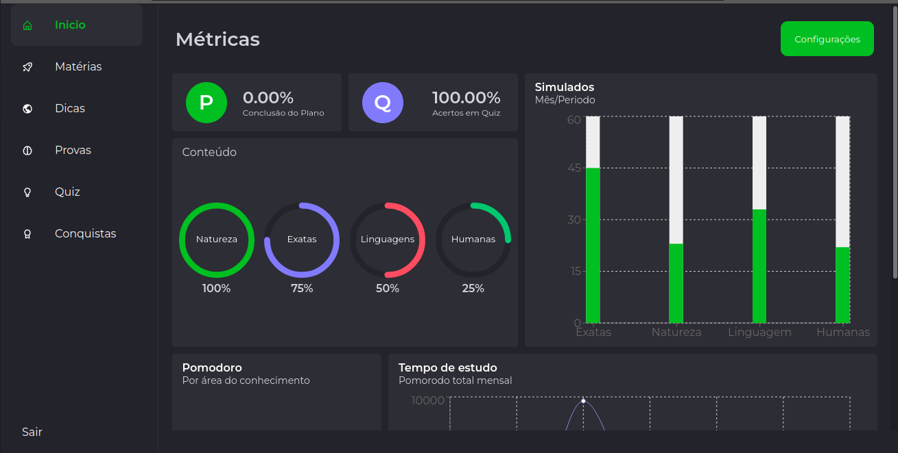

# AjudaNois

<!---Esses são exemplos. Veja https://shields.io para outras pessoas ou para personalizar este conjunto de escudos. Você pode querer incluir dependências, status do projeto e informações de licença aqui--->

> A plataforma tem a inteção de agrupar todo o conteúdo escolar voltado para os vestibulares. Facilitando a organização para o professor e metrificando o desempenho dos alunos para que possam melhorar de acordo com a necessidade.

### Ajustes e melhorias

O projeto ainda está em desenvolvimento e as próximas atualizações serão voltadas nas seguintes tarefas:

- [x] Adição da tela de login
- [x] Adicionando botão de ação para login com o google
- [x] Adição do gráfico de acertos por simulado em cada área
- [x] Adição do gráfico de porcentagem de acertos por matéria
- [x] Adição da visualização da porcentagem do progresso no plano de estudos e acertos no quiz
- [x] Adição da tela de conquistas
- [x] Adição da possibilidade de compartilhar as conquistas
- [x] Adição da tela com cards de dicas
- [ ] Adição da visualização de contéudo por matéria
- [ ] Desenvolver uma imagem para a área de login
- [ ] Adição do gráfico de tempo por área
- [ ] Adição do QUIZ com questões cadastradas pelos professores
- [ ] Adição do plano de estudo do aluno
- [ ] Adição da visualização de contéudo por matéria

Ele esta disponivel para a visualização por esse [link]('https://ajudanois.vercel.app/).

## 💻 Pré-requisitos

Antes de começar, verifique se você atendeu aos seguintes requisitos:

<!---Estes são apenas requisitos de exemplo. Adicionar, duplicar ou remover conforme necessário--->

- Você tem a versão 14+ do ` node`

## 🚀 Instalando AjudaNois

Para usar AjudaNois, siga estas etapas:

1. Clone o repositório
2. Acesse a pasta do projeto
3. Execute o comando de instalação de pacotes que você preferir. `yarn`
4. Agora basta executar o comando `yarn dev ou npm run dev`

## 📫 Contribuindo para AjudaNois

<!---Se o seu README for longo ou se você tiver algum processo ou etapas específicas que deseja que os contribuidores sigam, considere a criação de um arquivo CONTRIBUTING.md separado--->

Para contribuir com AjudaNois, siga estas etapas:

1. Bifurque este repositório.
2. Crie um branch: `git checkout -b <nome_branch>`.
3. Faça suas alterações e confirme-as: `git commit -m '<mensagem_commit>'`
4. Envie para o branch original: `git push origin <nome_do_projeto> / <local>`
5. Crie a solicitação de pull.

Como alternativa, consulte a documentação do GitHub em [como criar uma solicitação pull](https://help.github.com/en/github/collaborating-with-issues-and-pull-requests/creating-a-pull-request).

## 🤝 Colaboradores

Agradecemos às seguintes pessoas que contribuíram para este projeto:

<table>
  <tr>
    <td align="center">
      <a href="#">
         
        
          <b>Bryan</b>
        
      </a>
    </td>
     <td align="center">
      <a href="#">
         
        
          <b>Léo</b>
        
      </a>
    </td>
    <td align="center">
      <a href="#">
         
        
          <b>Renan</b>
        
      </a>
    </td>
  </tr>
</table>

<!--
## 😄 Seja um dos contribuidores 

Quer fazer parte desse projeto? Clique [AQUI](CONTRIBUTING.md) e leia como contribuir.

## 📝 Licença

Esse projeto está sob licença. Veja o arquivo [LICENÇA](LICENSE.md) para mais detalhes.
-->

[⬆ Voltar ao topo](#nome-do-projeto) 
